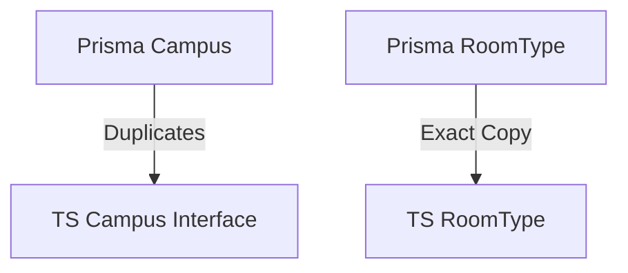

# Complete Codebase Analysis

## 1. Type System Analysis

### 1.1 Campus Types
```typescript
// src/types/campus.ts
export interface Campus {
  id: string;
  name: string;
  code: string;
  type: CampusType;
  status: Status;
  
  // Location Information
  streetAddress: string;
  city: string;
  state: string;
  country: string;
  postalCode: string;
  gpsCoordinates?: string;
  
  // Relations
  buildings?: Building[];
}
```

### 1.2 Role Definitions
```typescript
// src/types/roles.ts
export interface RoleTemplate {
  name: string;
  description: string;
  context: 'core' | 'campus';
  permissions: string[];
}
```

## 2. Schema Analysis

### 2.1 Prisma Schema
```prisma
// prisma/schema.prisma
model Campus {
  id                String     @id @default(cuid())
  name              String
  code              String     @unique
  type              CampusType
  status            Status     @default(ACTIVE)
  
  // Location Information
  streetAddress  String
  city           String
  state          String
  country        String
  postalCode     String
  gpsCoordinates String?
  
  // Relations
  buildings Building[]
}
```

## 3. Key Issues

### 3.1 Duplicate Definitions


### 3.2 Inconsistent Structures
```typescript
// Inconsistent CampusRole definitions
interface CampusRole {
  permissions: string[] // Flat structure
}

model CampusRole {
  role       Role // Relational structure
  permission Permission[]
}
```

## 4. Recommendations

### 4.1 Centralized Type Management
```typescript
// Proposed shared types
export type UnifiedCampus = PrismaCampus & {
  customFields?: CampusCustomFields
};
```

### 4.2 Validation Schemas
```typescript
// Example Zod schema
export const CampusSchema = z.object({
  id: z.string(),
  name: z.string().min(3),
  type: z.nativeEnum(CampusType),
  status: z.nativeEnum(Status)
});
```

## 5. Implementation Plan

### Phase 1: Immediate Fixes
1. Remove duplicate type definitions
2. Align interface structures
3. Create base validation schemas

### Phase 2: Structural Improvements
1. Implement type generation pipeline
2. Centralize permission definitions
3. Add validation for complex types

### Phase 3: Long-term Maintenance
1. Add type relationship diagrams
2. Setup schema consistency CI checks
3. Document type governance policy
